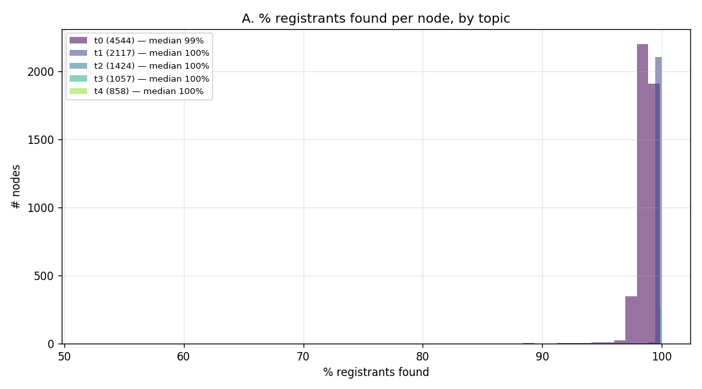
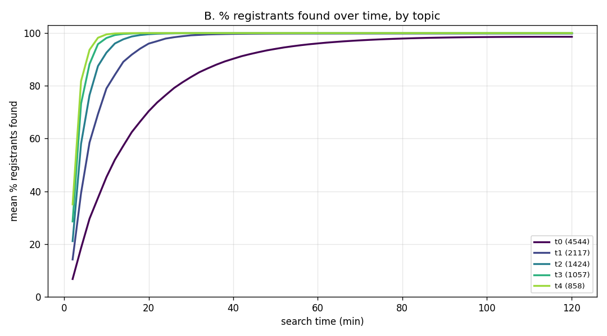
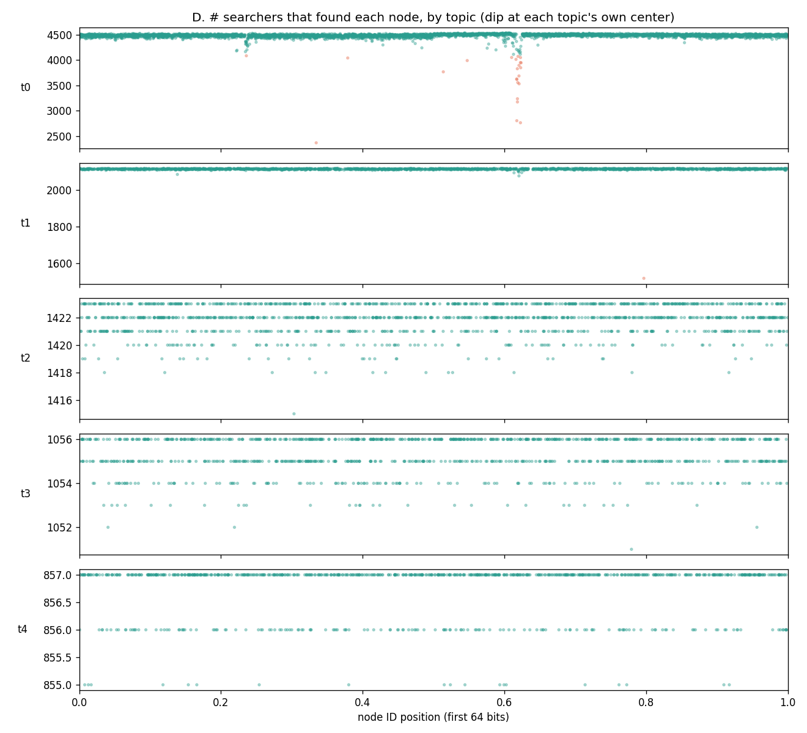
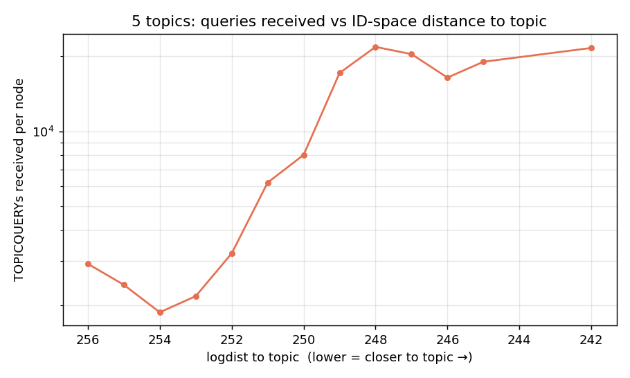
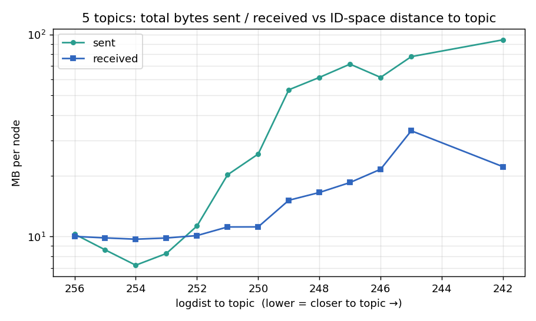

# Topic Discovery Evaluation — 5 Topics, reg-3 / search-20 (spread topic IDs)

## Setup

- **10,000 nodes, 5 topics.** Each node draws one topic via a **Zipf distribution (s = 1.07)** and both *registers* and *searches* it.
- **Topic IDs are spread across the keyspace** with a golden-ratio (Weyl) sequence (positions 0.090, 0.236, 0.472, 0.618, 0.854) — no clustering, each topic in its own region.
- **Registration bucket size 3, search bucket size 20**, with the **#55 fix** (`collectOnePerDist` returns aux nodes by distance to the *topic*, not the registrar).
- **Ad lifetime 15 min**, continuous registration + renewal, **no churn**.
- 2h search window — every topic converges inside it.

## Headline result

| topic | position | registrants | recall (mean) | coverage |
|---|---|---|---|---|
| t0 | 0.618 | 4,544 | **98.6%** | 100% |
| t1 | 0.236 | 2,117 | 99.8% | 100% |
| t2 | 0.854 | 1,424 | 99.9% | 100% |
| t3 | 0.472 | 1,057 | 99.9% | 100% |
| t4 | 0.090 | 858 | ~100% | 100% |

**Collective coverage is 100% on every topic** (neverFound = 0). Per node, every topic is discovered at **98.6–100%**, including the dominant topic.

## Registration

Registration is healthy and complete — **all ads placed, none unplaced, neverFound = 0** across all five topics. With spread topic IDs, each topic occupies its own keyspace region, so there is no inter-topic registrar contention.

## Search results

**A — % registrants found per node, by topic (distribution).** Each topic's mass sits in a tight band; even the dominant topic t0 is at 98.6%.

**B — % registrants found over time, by topic.** Each topic converges cleanly; t0 settles at ~98.6% by ~t=120 min, the smaller topics at ~100% within ~20–40 min.

**D — # searchers that found each node across ID-space, by topic.** Every topic sits at ~full uniformly, **except a tiny residual dip on t0 at its own center (x≈0.618)** (red). t1–t4 show no center dip.

## The residual: dominant-topic center hotspot

The only visible residual is on **t0**, the largest topic (4,544 members), confined to registrants whose own ID sits nearest t0's ID (x≈0.618) — mean recall there dips to ~50–90% for a handful of nodes while the topic mean stays at 99%. Smaller topics show no such dip. This is the same **topic-center funnel** characterized in the single-topic study: the keyspace neighborhood of a topic is sparse in registrars and those registrars are admission-capped, so registrants nearest a *heavily populated* topic are served by a thin, capacity-limited set of close registrars. The effect scales with topic size, so it is visible only for the dominant topic — and even there it is now small (t0 = 98.6% vs the whole-run mean).

The `meanDup` gradient across topics confirms the picture: t0 has the lowest duplicate rate (6.6) and the smaller topics the highest (t4 = 34.5) — the small topics are fully drained/over-searched, while t0 is the only one with any reach headroom left.

## Overhead

Per-node traffic across the ID space, binned by `logdist(own-topic, node)` — each
node mapped to *its own* topic via the registrant manifest (all 10,000 mapped), from
an instrumented re-run (`-overhead-out`, integration build = `topdisc` +
#71/#81/#83/#84). This is the follow-up the prior version promised (the earlier
run's dump exceeded the teardown watchdog before writing `overhead.json`; the grace
is now 90 min and the metrics compacted). Four per-node inbound/traffic views:

### 1. Queries received (TOPICQUERY)

TOPICQUERYs received rise toward the topic (~22k at the closest), staying high — no
fall-off at the very closest bin (the funnels are shallower with spread IDs).

### 2. Registrations received (REGTOPIC)

> ⚠️ **Not yet captured.** Needs a per-node REGTOPIC-received counter; re-instrumentation
> + re-run pending.

### 3. Ads received

> ⚠️ **Not yet captured.** Ads stored per registrar is derivable from `metrics.json`
> (`byHost`), and ad records received on the wire needs a counter; pending.

### 4. Total bytes sent / received

Far-from-own-topic nodes send ~10 MB (vs ~3.7 MB single-topic) because they are close
to — and register for — *other* topics; the near-topic peak is lower (~94 MB vs
~170 MB). The far/near byte skew flattens from ~45× to **~9×**.

**Summary table:**

| logdist | nNodes | tx MB | rx MB | TQ rcv |
|---:|---:|---:|---:|---:|
| 256 (far) | 4990 | 10.3 | 10.0 | 2,929 |
| 252 | 284 | 11.3 | 10.1 | 3,225 |
| 250 | 100 | 25.6 | 11.2 | 8,031 |
| 249 | 40 | 53.3 | 15.1 | 17,151 |
| 247 | 13 | 71.5 | 18.5 | 20,412 |
| 242 (closest) | 1 | 94.3 | 22.2 | 21,621 |
| **ALL** | **10000** | **10.1** | **10.0** | **2,867** |

**Multi-topic spreads the load** — because topic IDs are spread, each topic's funnel
is separate and shallower, so no single node is as hot as single-topic (consistent
with the shallower recall dip, t0 = 98.6% vs single-topic 96%):

| | far node (ld 256) tx | closest node tx | mean tx / node | skew |
|---|---:|---:|---:|---:|
| single topic | 3.7 MB | ~170 MB | 7.6 MB | ~45× |
| 5 topics | 10.3 MB | ~94 MB | 10.1 MB | ~9× |

See [`report-single-topic-reg3-10k.md`](report-single-topic-reg3-10k.md) for the single-topic study.

## Conclusion

With **spread topic IDs + reg-3 / search-20 + #55**, the protocol discovers **the entire population of every topic collectively** (100% coverage) and, per node, **98.6–100% of every topic including the dominant one**. The only residual is a small dominant-topic center hotspot — a structural property of load concentrating at a heavily-populated topic's ID, now measured in traffic: even the hottest node carries ~9× (vs ~45× single-topic), because spread IDs give each topic its own shallower funnel. This is a strong multi-topic operating point.

Run dir on London: `~/eval-overhead-5top-10k-20260713-210832/` (overhead + tables); metrics-out re-run in progress for the per-topic search/registration figures at this exact build.
