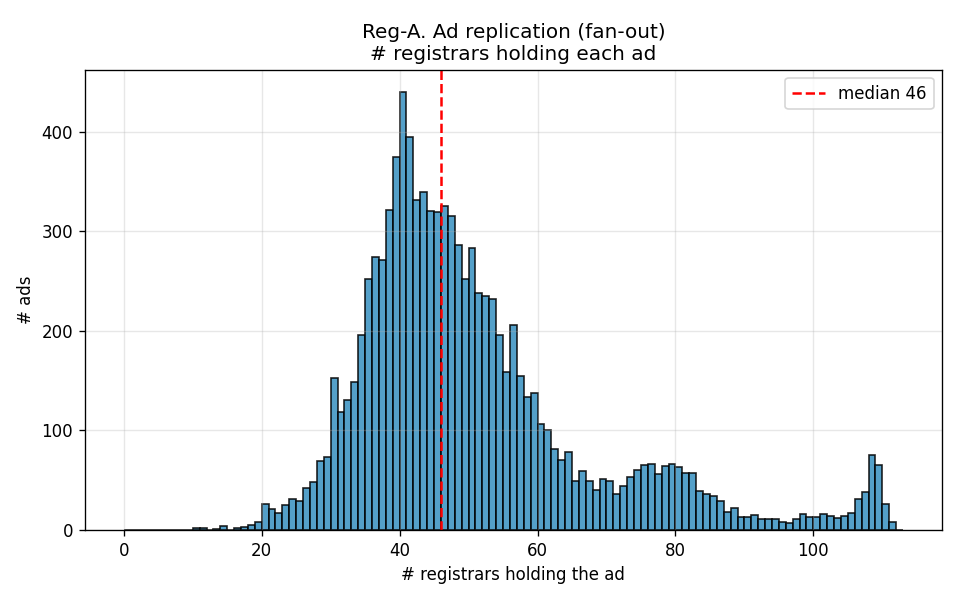
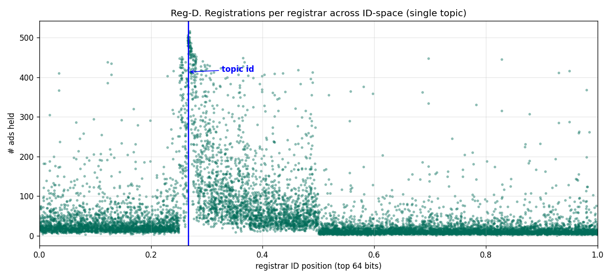
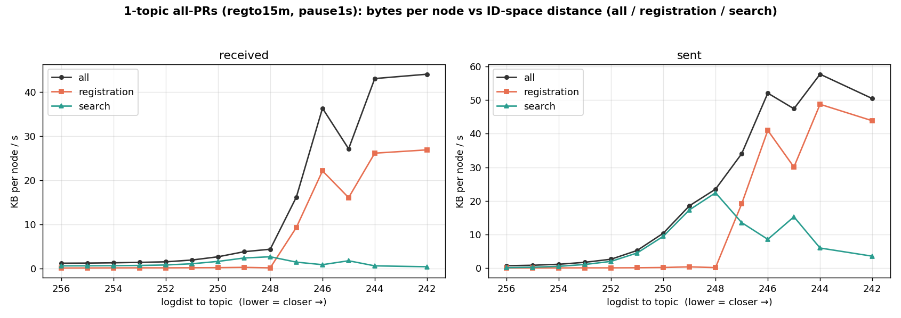
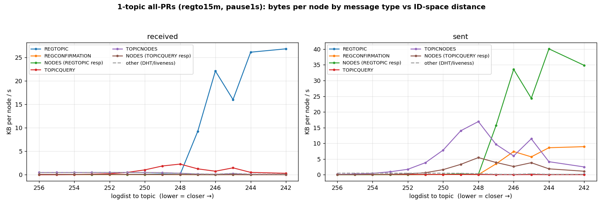
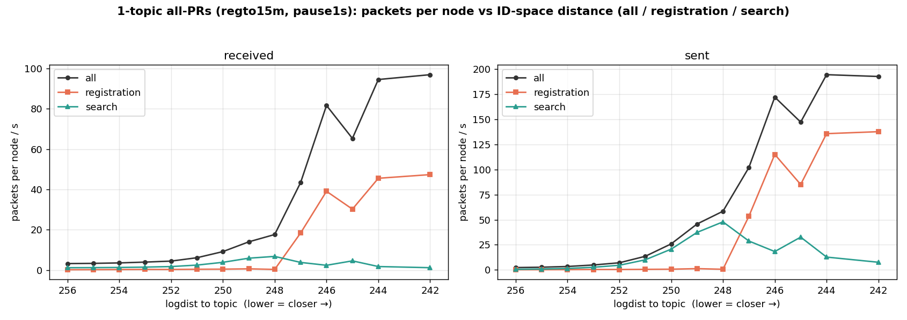
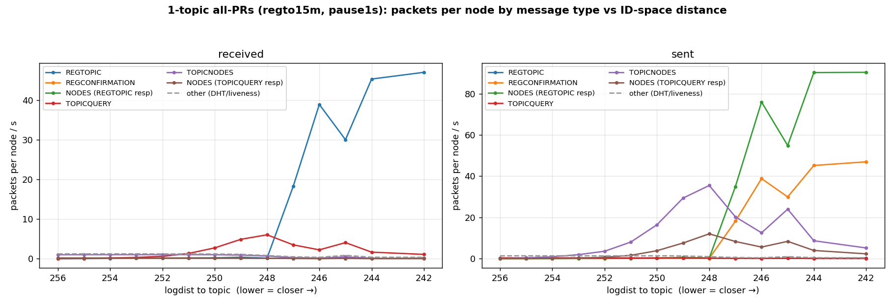

# Topic Discovery Evaluation — Single Topic (all-PRs, 10k)

**Run:** `eval-allprs-1top-regto15m-20260720-140640`
**Binary:** `integration/simnet-all-prs` — current `topdisc` + all open PRs (#71 eviction, #81 waiting-time bound, #91 search-tracking-on-shutdown, #92 IP-tracker, #94 REGTOPIC endpoint check) + testbed + per-message traffic instrumentation.
**PARAMS:** 10 000 nodes · `-all-register` · reg-bucket-size 3 · search-bucket-size 20 · ad-lifetime 15m · **reg-attempt-timeout 15m (1×AdLifetime)** · **search-pause-max 1s** · search-timeout 60m · topicNodesResultLimit 16 · seed 42.

---

## 1. Registration performance

> _Reference figures (reg-3 best-config run). This overhead-focused run did not emit the per-registrant records these need; a metrics companion run at this config would regenerate them._

---

## 2. Search performance

**Recall (this run):**

| metric | value |
|---|---|
| **Network coverage** (registrants found by ≥1 searcher) | **100.0%** (`neverFound=0`, from t=480 s) |
| Per-searcher recall (meanUniq) | 0.477 |
| Unique found per searcher (mean) | 4 767 / 9 999 |

**Key finding — recall is time-limited, not reach-limited.** Every registrant is discoverable (100% network coverage throughout). The per-searcher recall of 47.7% is a consequence of the 60 min search cap at 1 s consumption pace: the median registrant's find-count climbed the entire run with **no plateau** (p50 = 735 → 4 355 over t=480→3600 s, still +~90/120 s at the cutoff). Extrapolating the slope, per-searcher recall would approach 100% at ~3.5–4 h.

> _Reference figures (reg-3 best-config run) — optional._

---

## 3. Overhead — traffic per node vs ID-space distance

_All figures below are real, from this run (per-message-type instrumentation, rates over the 4 080 s search window)._

**Summary:** mean received **1.31 KB/s** per node · TOPICQUERY sent **0.381/s** per searcher · **5.59 TOPICNODES packets per query** · near-topic peak received **26.9 KB/s** (ld 242), registration-dominated.

The near-topic hotspot is REGTOPIC-ingress-driven; search traffic is a roughly uniform background across the ID space. Each TOPICQUERY is answered with ~6 TOPICNODES packets plus aux NODES referrals (~7 packets total), which is why TOPICNODES-sent dominates the near-topic search-serving traffic.

### Bytes

### Packets

