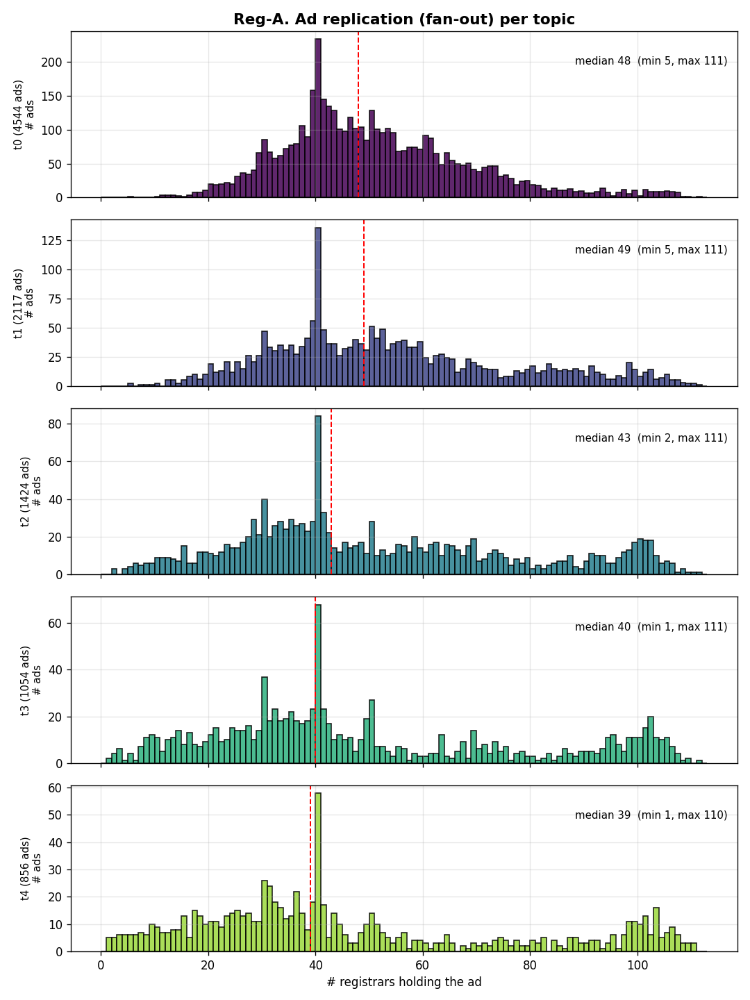
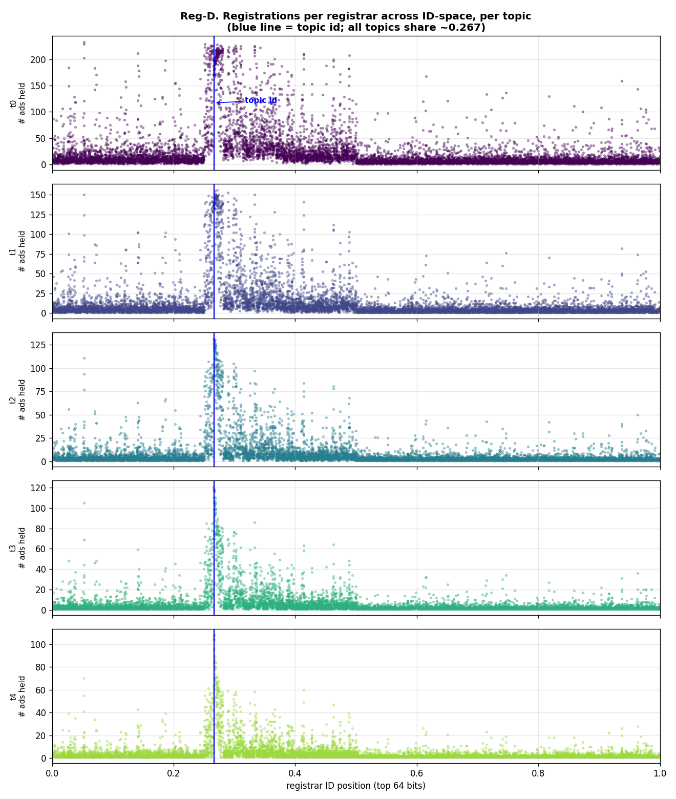
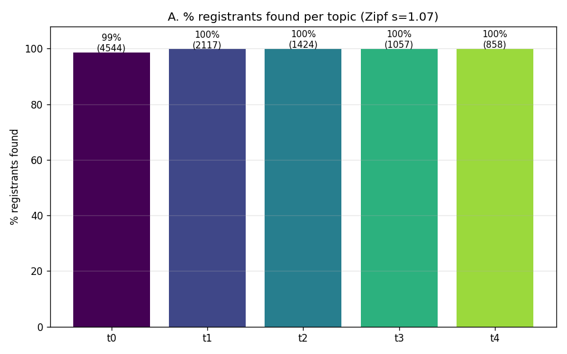
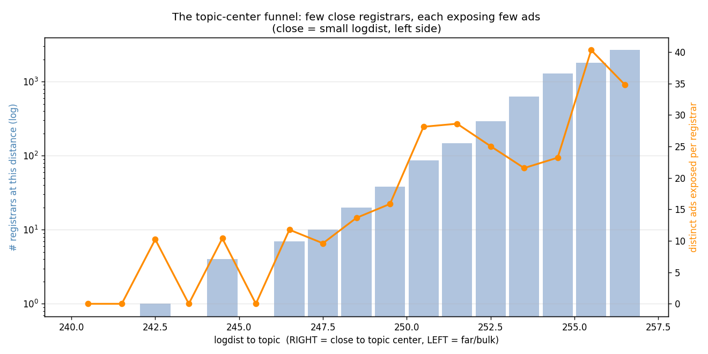
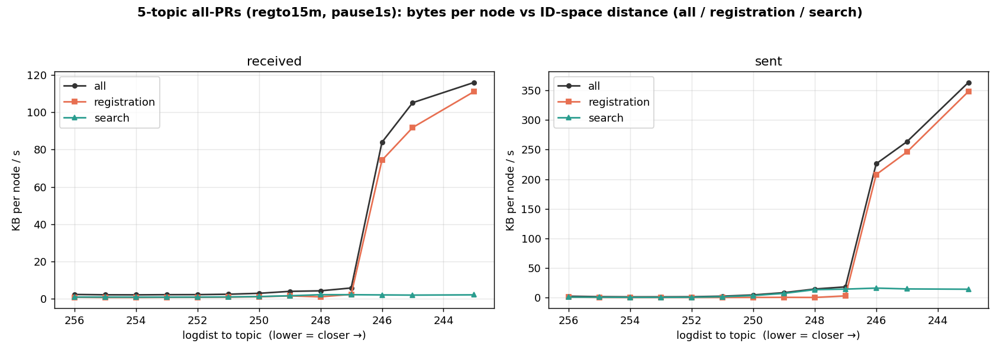
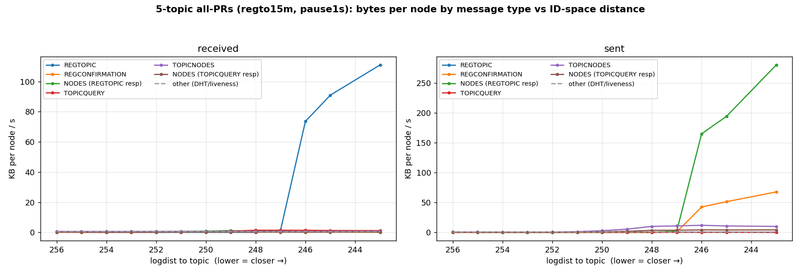
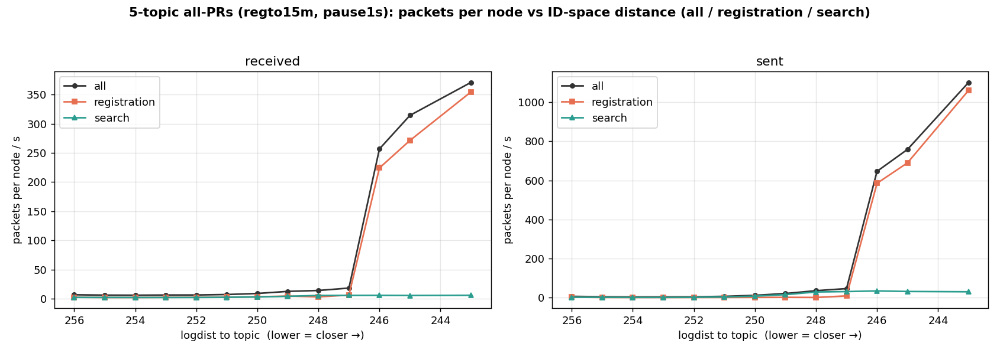
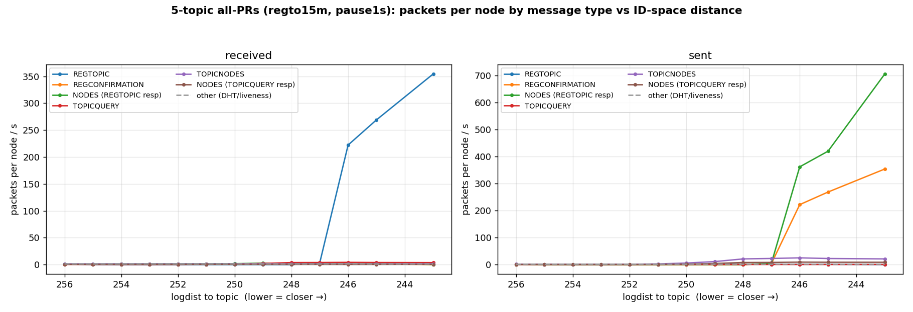

# Topic Discovery Evaluation — 5 Topics (all-PRs, 10k)

**Run:** `eval-allprs-5top-regto15m-20260720-140640`
**Binary:** `integration/simnet-all-prs` — current `topdisc` + all open PRs (#71 eviction, #81 waiting-time bound, #91 search-tracking-on-shutdown, #92 IP-tracker, #94 REGTOPIC endpoint check) + testbed + per-message traffic instrumentation.
**PARAMS:** 10 000 nodes · `-topics 5 -zipf-s 1.07` · reg-bucket-size 3 · search-bucket-size 20 · ad-lifetime 15m · **reg-attempt-timeout 15m (1×AdLifetime)** · **search-pause-max 1s** · search-timeout 60m · topicNodesResultLimit 16 · seed 42.

---

## 1. Registration performance

> _Reference figures (reg-3 best-config run). This overhead-focused run did not emit the per-registrant records these need; a metrics companion run at this config would regenerate them._

---

## 2. Search performance

**Recall (this run), per topic (Zipf membership):**

| topic | members | network coverage | per-searcher recall (meanUniq) |
|---|---:|---:|---:|
| 0 | 4 544 | 100% | 0.764 |
| 1 | 2 117 | 100% | 0.928 |
| 2 | 1 424 | 100% | 0.983 |
| 3 | 1 057 | 100% | 0.994 |
| 4 | 858 | 100% | 0.998 |

**Key finding — recall scales with membership size.** Network coverage is 100% for every topic (all registrants discoverable). Per-searcher recall is time-limited: smaller topics are fully covered within the 60 min window (99.8%), while the largest set (topic 0, 4 544 members) reaches 76% — the same time-budget effect as the single-topic run, scaled by set size.

> _Reference figures (reg-3 best-config run) — optional._

---

## 3. Overhead — traffic per node vs own-topic ID-space distance

_All figures below are real, from this run (per-message-type instrumentation, binned by each node's own-topic logdist, rates over the 4 080 s search window)._

**Summary:** mean received **2.33 KB/s** per node · TOPICQUERY sent **0.547/s** per searcher · **4.26 TOPICNODES packets per query** · near-topic peak received **111.2 KB/s** (own-topic ld 243), registration-dominated.

Binned by each node's own-topic distance, the funnel is the same shape as single-topic but higher per-node at the center (REGTOPIC-received ~111 KB/s; aux-NODES-sent peaks even higher) because the near-topic nodes for each of the 5 topics concentrate that topic's registration ingress. Search-serving traffic stays small and uniform.

### Bytes

### Packets

