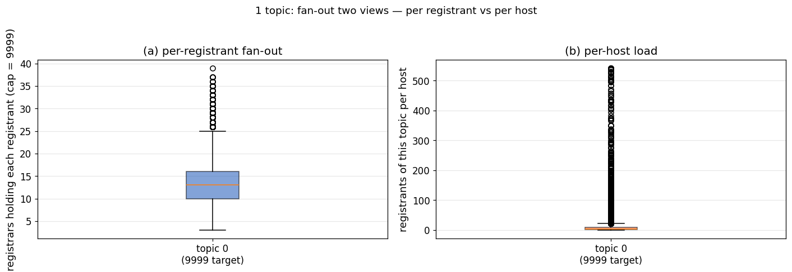
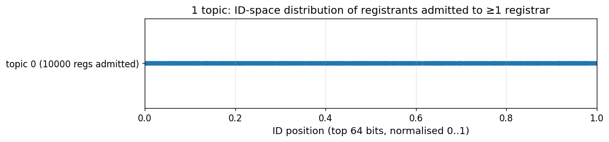
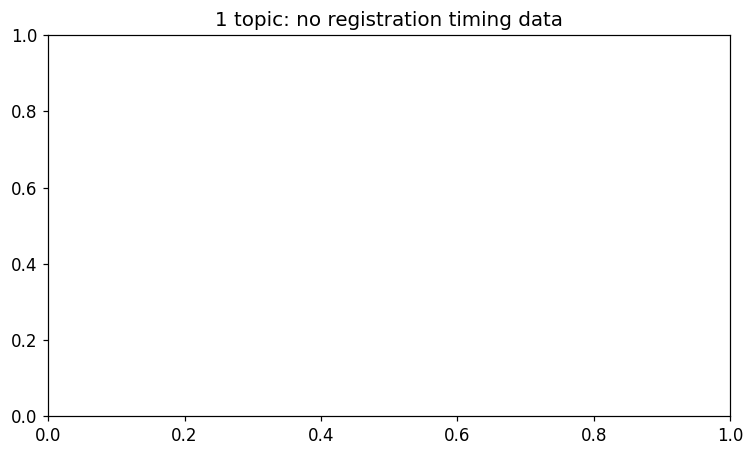
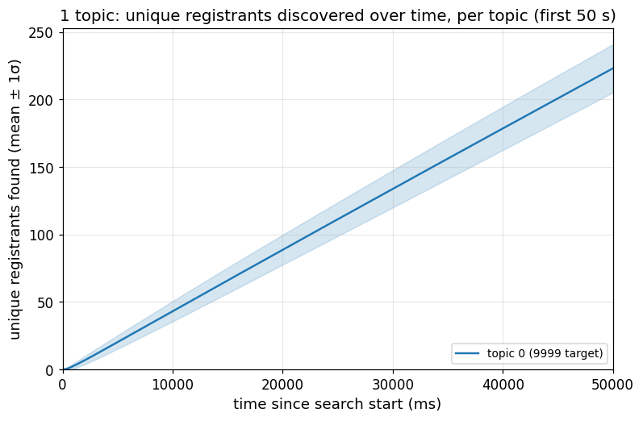
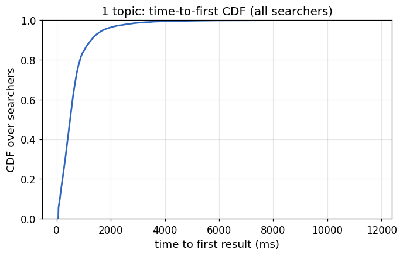
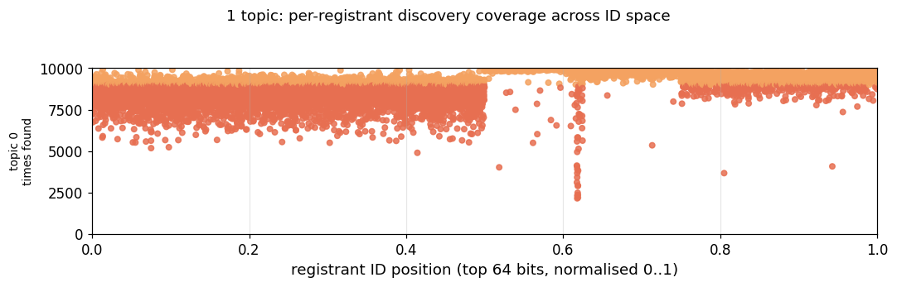

# Topic discovery evaluation — single topic (10k nodes)

**Scenario:** 10,000 nodes, one shared topic. Every node both *registers* an ad for
the topic and *searches* for it (`-all-register`). Covers registration
performance, search performance (recall and found-vs-missed across the ID space),
and per-node message/byte overhead across the ID space.

Integration build = `topdisc` + PRs #71 (eviction) + #81 (waiting-time lower bound
+ G floor) + #83 (`collectOnePerDist` topic-dist fix) + #84 (iptree depth
normalization), plus the simnet measurement hooks.

## Setup

```
nodes=10000  topics=1 (all-register)  reg-bucket-size=3  search-bucket-size=20
ad-lifetime=15m  reg-attempt-timeout=22.5m  max-nodes-per-source-per-bucket=1
bootstrap-wait=3m  register-wait=5m  search-timeout=4h (converged)
register-stagger=30ms  search-stagger=10ms  search-pause-max=400ms  refresh-interval=10m
latency=30ms  bw=100Mibps  router-shards=96  link-no-aqm  max-bootnodes=5  seed=42
```

Registration/search figures are from the converged 4 h run; the overhead
distribution is from a 60 min run of the same config (the ID-space overhead shape
stabilizes early).

## Registration performance

Every one of the 10,000 ads is placed. With `reg-bucket-size=3` the fan-out
(distinct registrars holding each ad) is **median 13** (min 3, max 39) at the end
of the 5 min registration window — lower than the reg-10 configuration's ~46,
by design: fewer active slots per bucket.

| metric | value |
|---|---|
| ads placed | 10,000 / 10,000 |
| fan-out (registrars per ad) | median 13 (min 3, max 39) |
| mean time to first remote admission | 310 s |

**Fan-out and per-host load.** (a) how many registrars hold each ad; (b) how many
ads each registrar holds.



**Registrants across ID space.** Admitted registrars concentrate around the topic
id.



**Registration latency.** Mean time to first remote admission.



## Search performance

**Per-searcher recall.** Each searcher finds a **median of 9,240 of the 9,999**
other registrants (~**92%**); min 205, max 9,573. No searcher reaches 100%
(`full-recall 0/10000`) — the last ~8% is the reach tail. Collective coverage is
**100%** (every registrant found by ≥1 searcher).

| metric | value |
|---|---|
| per-searcher recall | median 9,240 / 9,999 (~92%) |
| full-recall searchers | 0 / 10,000 |
| collective coverage | 100% |

**Unique registrants discovered over time.** Recall rises steeply then plateaus.



**Time to first result.**



**Found vs. missed across ID space.** Discovery is fairly uniform (~85–95% of
searchers per registrant) across the keyspace, with a visible **dip right at the
topic id** (x ≈ 0.62): the registrars closest to the topic are found by fewer
searchers — the reg-3 closest bucket holds few, heavily-contended slots.



## Overhead across the ID space

Per-node sent/received packets/bytes and TOPICQUERYs received, binned by
`logdist(topic, node)` (lower logdist = closer to the topic; ~half the nodes sit at
logdist 256, the far end).

| logdist | nNodes | tx MB | rx MB | TQ rcv |
|---:|---:|---:|---:|---:|
| 256 (far) | 5087 | 3.7 | 6.9 | 394 |
| 252 | 320 | 23.3 | 9.7 | 6,329 |
| 250 | 65 | 82.9 | 17.8 | 23,591 |
| 247 | 14 | 86.5 | 31.0 | 16,516 |
| 246 | 3 | 167.8 | 97.8 | 11,384 |
| 242 (closest) | 1 | 129.8 | 95.8 | 6,613 |
| **ALL** | **10000** | **7.6** | **7.5** | **1,500** |

Load rises monotonically toward the topic: the handful of near-topic registrars
send ~170 MB and field ~24k TOPICQUERYs each, vs. ~3.7 MB / ~400 for the far
majority — a **~45× byte skew** driven by ID-space proximity. (The comparison
figure below shows this run in blue against the 5-topic run.)


## Conclusion

Registration places every ad; with reg-3 the fan-out is a lean ~13. Search reaches
~92% median per-searcher recall with 100% collective coverage. The ceiling is
**search reach** — a searcher queries only the registrars closest to the topic, and
the very closest (reg-3) slots are the most contended (the ID-space dip). Overhead
is sharply concentrated on those same near-topic registrars (~45× skew).

Run dirs on London: `~/eval-integration-10k-20260713-133630/` (search/reg metrics),
`~/eval-overhead-10k-20260713-194637/` (overhead).
