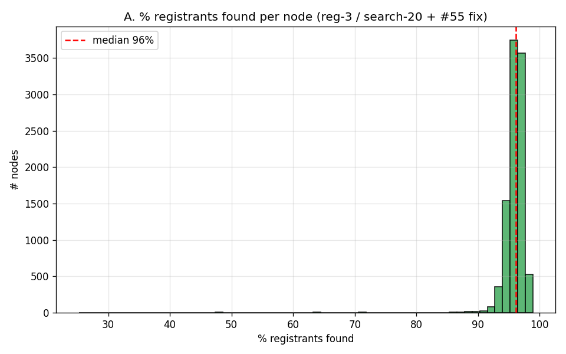
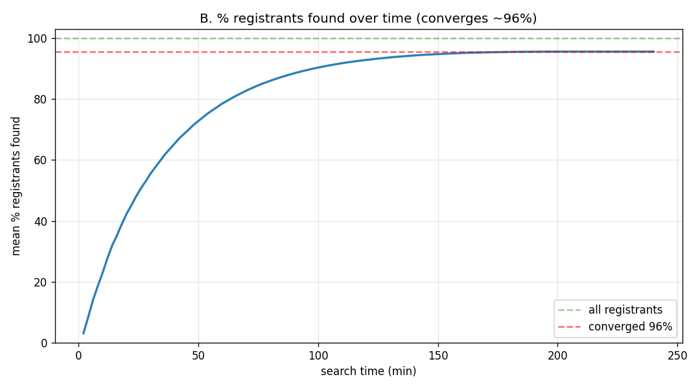
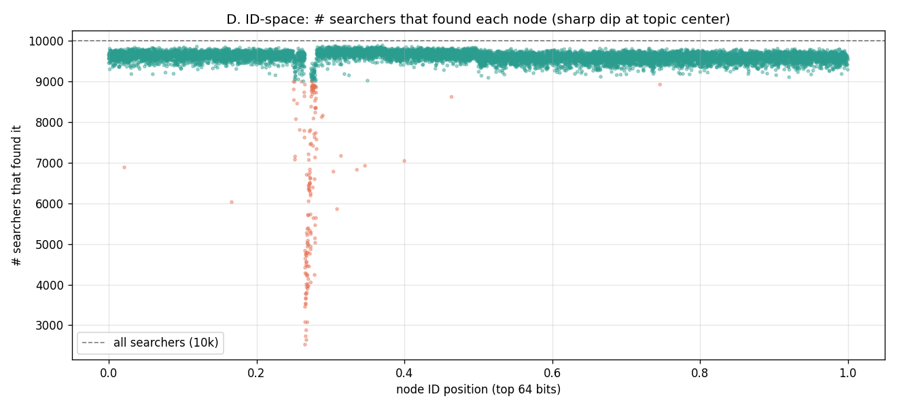
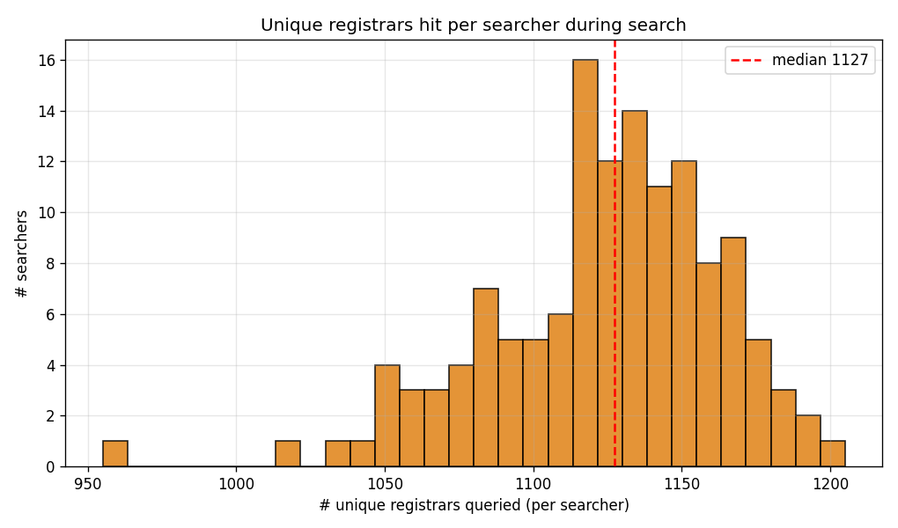
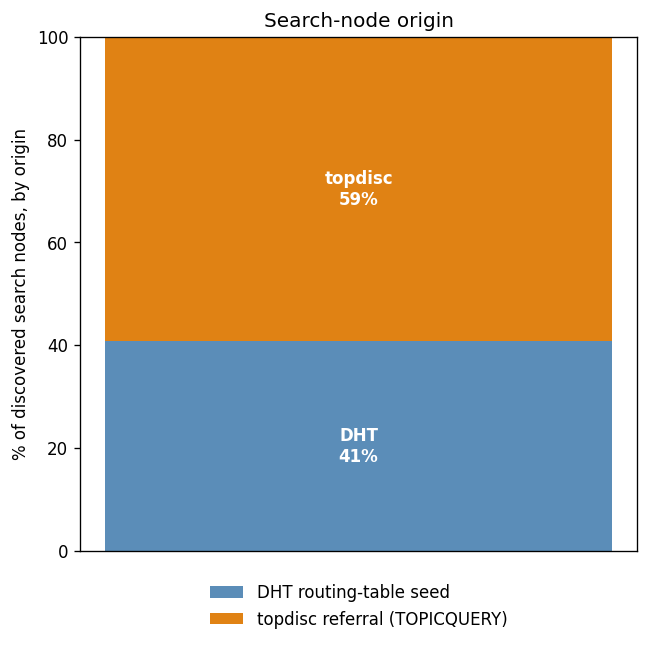
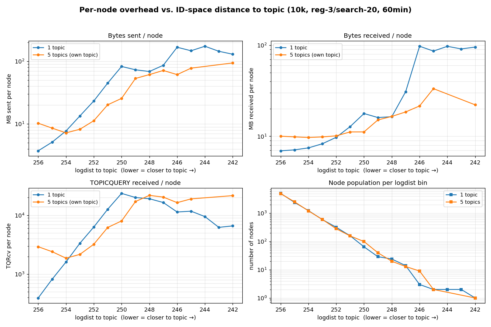

# Topic Discovery Evaluation — Single Topic, reg-3 / search-20 (best config)

## Setup

- **10,000 nodes, one common topic** — every node both registers and searches it (`-all-register`).
- **Registration bucket size 3, search bucket size 20**, with the **#55 fix** (`collectOnePerDist` returns aux nodes by distance to the *topic*, not the registrar).
- **Ad lifetime 15 min**, continuous registration + renewal, **no churn**.
- 4h search window — converges cleanly and stays flat.

10,000 nodes on one topic reach **p50 = 96.15%** per-node recall (mean 95.6%) with **100% collective coverage**.

## Headline result

| metric | value |
|---|---|
| per-node recall (p50) | **96.15%** (9,615 / 10,000) |
| per-node recall (mean) | 95.6% |
| collective coverage | **100%** (neverFound = 0) |
| mean duplicate finds / searcher | 5.13 |
| convergence | flat after ~t=200 min |

Every one of the 10,000 registrants is discovered by at least one searcher, and the *typical* node discovers ~96% of the entire population.

## Registration

Registration is healthy and complete — **all 10,000 ads placed, none unplaced, neverFound = 0**. Every registrant is discovered by at least one searcher.

## Search results

**A — % registrants found per node (distribution).** Median 96%, mean 95.6%; the mass sits in a tight band around 96%.

**B — % registrants found over time.** Climbs steadily and converges at ~96% (flat after ~t=200 min).

**D — across ID-space.** The band sits at ~96% (green = found by ≥90% of searchers) uniformly across the keyspace, **except a single sharp dip at the topic center** (x≈0.267, the topic ID), where nodes drop to 25–90% (red). This is the entire residual — it is *not* spread evenly.

**Reach — unique registrars hit per searcher.** Each searcher queries a median of **1,127** distinct registrars (mean 1,123) over the run.

**Search-node origin.** Of the nodes each searcher discovers, **59%** come from topdisc referrals (TOPICQUERY responses) and **41%** from the DHT routing-table seed.

## The residual is a topic-center hotspot

The dip at the topic ID is a **structural funnel**, not a coverage failure. Reach instrumentation (per-searcher queried-registrar sets, 134 sampled searchers) shows the keyspace neighborhood of the topic is sparse and low-yield:

| logdist to topic | # registrars | queried by (of 134) | distinct ads exposed / registrar |
|---|---|---|---|
| 242–246 (**center**) | **~5** | 134 (all) | **~10** |
| 246–248 | 17 | 134 | 10.5 |
| 248–250 | 58 | 133 | 15.1 |
| 250–252 | 234 | 119 | 28.4 |
| 252–254 | 915 | 59 | 22.7 |
| 254–257 (**bulk**) | **~5,700** | 10 | **~34** |

Within logdist 250 of the topic there are only ~80 registrars; beyond it, thousands. Every searcher queries the ~5 closest registrars, but each exposes only ~10 distinct ads — their tables are admission-capped (`WaitTime` grows as `AdLifetime / occupancy¹⁰`, plus `AdCacheSize` / `RegBucketSize` limits). A registrant at the topic center therefore depends on this thin, capacity-limited funnel and is replicated/surfaced far less than one served by the vast far region. **No node is ever down or unresponsive** — it is pure capacity concentration at the topic ID.

## Overhead across the ID space

Per-node traffic was captured in an instrumented re-run of this exact config (`-overhead-out`, integration build = `topdisc` + #71/#81/#83/#84), binned by `logdist(topic, node)` (lower logdist = closer to the topic; ~half the nodes sit at logdist 256, the far end). It **measures the topic-center funnel directly**:

| logdist | nNodes | tx MB | rx MB | TQ rcv |
|---:|---:|---:|---:|---:|
| 256 (far) | 5087 | 3.7 | 6.9 | 394 |
| 254 | 1249 | 7.7 | 7.5 | 1,612 |
| 252 | 320 | 23.3 | 9.7 | 6,329 |
| 250 | 65 | 82.9 | 17.8 | 23,591 |
| 248 | 24 | 68.8 | 16.4 | 19,141 |
| 247 | 14 | 86.5 | 31.0 | 16,516 |
| 246 | 3 | 167.8 | 97.8 | 11,384 |
| 242 (closest) | 1 | 129.8 | 95.8 | 6,613 |
| **ALL** | **10000** | **7.6** | **7.5** | **1,500** |

The near-topic registrars (logdist 246–250) send **~80–170 MB** and field **~12k–24k TOPICQUERYs** each, versus ~3.7 MB / ~400 for the far majority — a **~45× byte skew** driven purely by ID-space proximity. TOPICQUERYs-received peak in the 250–251 band and then ease at the very closest nodes (the one-per-source-per-bucket rule spreads queries off the single nearest node), while byte volume keeps climbing (the closest nodes are the biggest referral hubs). This is the *same* thin, capacity-capped funnel the recall dip exposes, now measured in bytes: the ~80 registrars within logdist 250 of the topic are both the **recall bottleneck** and the **traffic hotspot**.

## Conclusion

The tuned **reg-3 / search-20 + #55** config reaches **p50 = 96%** with 100% collective coverage. The remaining ~4% is entirely the **topic-center hotspot**: registrants nearest the topic ID, served by a sparse, capacity-capped set of close registrars — the same handful of nodes that carry a ~45× share of the network traffic. This is load concentrating at the topic ID, not a discovery failure, and it scales with topic size (worst for the dominant topic in a multi-topic deployment).

Run dirs on London: `~/eval-integration-10k-20260713-133630/` (search/reg), `~/eval-overhead-10k-20260713-194637/` (overhead).
