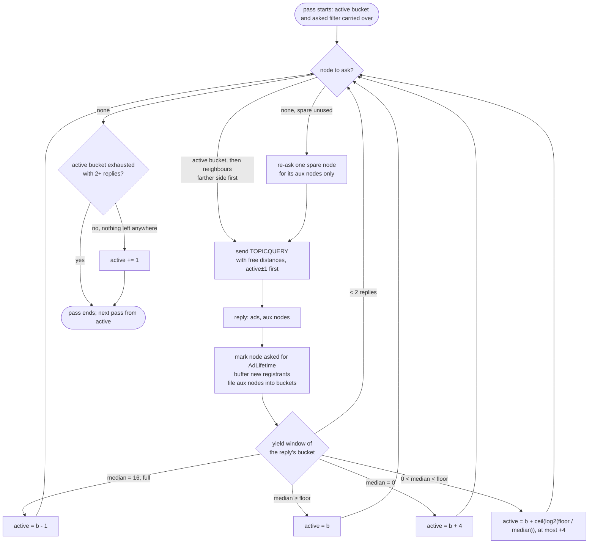

# Adaptive topic search: the algorithm

Companion to [topic-search-adaptive-distance.md](topic-search-adaptive-distance.md),
which gives the motivation and the results. This note is the procedure
itself: the state a searcher keeps, the constants it uses, the decision at
each reply, and the flow of one search pass.

## State per search

| field | meaning |
|---|---|
| `buckets[0..D-1]` | the search table: bucket *i* holds candidate registrars at log-distance `256 - i` from the topic hash, so bucket 0 is the farthest half of the ID space and bucket D-1 the closest neighbourhood. Each bucket holds at most `SearchBucketSize` nodes, split into `new` (not yet asked) and `asked`. |
| `active` | the bucket the search queries; starts at 0 (farthest) and is carried from one pass to the next |
| `yield[i]` | the ad counts of the last `searchYieldWindow` replies from bucket *i* |
| `asked` filter | nodes this search has already queried, kept for one ad lifetime and shared by every pass of the search |
| `spare` | nodes offered by replies that the asked filter rejected; one of them may be re-asked once per pass, only to learn new nodes from its reply |
| `resultBuffer` | registrants received and not yet handed to the caller |

## Constants

Values as used in every simulation (the instrumentation build, which
follows the spec table sizes); the upstream code defaults, which no run used,
are given in brackets where they differ.

| name | value | where | role |
|---|---:|---|---|
| `SearchYieldFloor` | 4 in the runs; 0 = feature off | `Config` (testbed `scenario.topic.search_yield_floor`) | the ad count per reply below which the active bucket moves closer |
| `TopicNodesLimit` | 16 | `Config` (constant on the PR branch) | ads a registrar returns per TOPICQUERY reply; a reply of this size is "full" and its count is censored |
| `searchYieldWindow` | 4 | `search.go` | replies per bucket kept for the density estimate |
| `searchMaxJump` | 4 | `search.go` | most buckets one decision may move the search closer |
| minimum samples | 2 | `observe` | replies from a bucket needed before any decision; medians of the window are used |
| `searchTableDepth` (D) | 10 (upstream default 18) | `search.go` | buckets in the search table |
| `SearchBucketSize` | 16 (upstream default 8) | `Config` | candidates kept per bucket |
| `RegBucketSize` | 5 (upstream default 10) | `Config` | copies of an ad the *registration* places per bucket; sets the density the search measures |
| `AdLifetime` | 15 min | `Config` | how long an ad lives on a registrar; also the asked filter's memory |
| `AuxNodesLimit` | 8 | `Config` | extra nodes a registrar attaches to a reply, one per requested distance, honouring the first requested distances |
| `searchBucketSubnet`, `searchBucketIPLimit` | /24, 1 | `search.go` | at most one node per /24 subnet per bucket |
| `regloopMinTime` | 2 s | `v5_topic.go` | minimum time between two passes of a search |
| `searchFilterLimit` | 5000 | `searchfilter.go` | most entries the asked filter (and the result filter) keeps; oldest expire first |

Only the first six drive the adaptive decision. The rest are the pre-existing
table and registration parameters the decision is measured against.

## The decision at each reply

A TOPICQUERY reply from a node in bucket *b* carries `ads` registrant
records (0 to `TopicNodesLimit`). The searcher appends `ads` to `yield[b]`,
keeps the last `searchYieldWindow` entries, and, once there are at least 2,
takes the lower and upper medians of the window:

```
observe(b, ads):
    yield[b] = last searchYieldWindow of (yield[b] + [ads])
    if len(yield[b]) < 2: return                    # not enough evidence
    lower, upper = medians(yield[b])
    if lower >= TopicNodesLimit:                     # replies are full: too close
        active = max(0, b - 1)
    elif upper >= SearchYieldFloor:                  # dense enough: stay here
        active = b
    elif upper == 0:                                 # nothing at all: leap
        active = min(D - 1, b + searchMaxJump)
    else:                                            # thin: one bucket per halving
        jump = ceil(log2(SearchYieldFloor / upper))
        active = min(D - 1, b + min(jump, searchMaxJump))
```

Why the jump size: registration places the same number of copies of every
ad in every bucket, and bucket *i+1* covers half the ID space of bucket *i*,
so the ads per node double with each bucket closer to the topic. A median of
1 against a floor of 4 therefore means two buckets closer; a median of 3
means one. No network size and no topic size enter the rule.

Why medians of at least two replies: one registrar cannot steer the search
with a single reply, whether by returning nothing or by returning a full
page. Lying through the reply costs it signed records, and the worst
outcome is one wrong bucket for one round, corrected by the next replies.

## Choosing whom to ask

```
queryTarget():
    for d in 0 .. D-1:                                # active bucket first, then
        for i in (active - d, active + d):            # its neighbours, farther side first
            if 0 <= i < D and buckets[i].new not empty:
                return any node of buckets[i].new
    if spare not empty and spare not yet used this pass:
        mark used; return one node of spare           # only for the nodes its reply carries
    return nil                                        # pass has nothing left to ask
```

The query lists the distances at which the table has free slots, the active
bucket and its two neighbours first, so the registrar's aux nodes refill the
part of the table the next queries need.

## Handling a reply

```
onReply(from, ads, auxNodes):
    b = bucketOf(from)
    observe(b, len(ads))                               # the decision above
    asked.add(from); remove from from the table        # never re-asked within AdLifetime
    resultBuffer += ads not seen before
    for n in auxNodes:                                 # candidates for later queries
        if asked.seen(n): spare[n] = n; continue
        add n to buckets[bucketOf(n)] if it has room, one node per bucket per reply,
            and its /24 is not already in that bucket
```

## When a pass ends

```
isDone():
    if resultBuffer not empty: return false
    if buckets[active].new is empty and len(yield[active]) >= 2:
        return true                                    # settled bucket worked through
    if any bucket has new nodes: return false
    if spare not empty and not yet used: return false
    if active < D - 1: active += 1                     # walked everything reachable: next pass one closer
    return true
```

The next pass starts from the same `active` bucket and the same asked
filter, seeded with the local DHT table, after at least `regloopMinTime`.
The pass loop itself is unchanged from the previous search.

## Flow of one pass



## What the old search did instead

The previous `queryTarget` opened buckets farthest first, one request each,
and then picked a random bucket among those with unasked nodes for every
query. Every bucket received the same share of queries, while the closest
buckets hold a handful of nodes shared by every searcher. The adaptive rule
replaces the random choice; the far-first opening is kept.

## Registrar side

One change, in `Table.collectOnePerDist`: when a reply attaches aux nodes at
the requested distances, the registrar picks a random node of its table at
each distance instead of the first entry, so different searchers learn
different nodes. Old and new searchers interoperate; no message field was
added.
