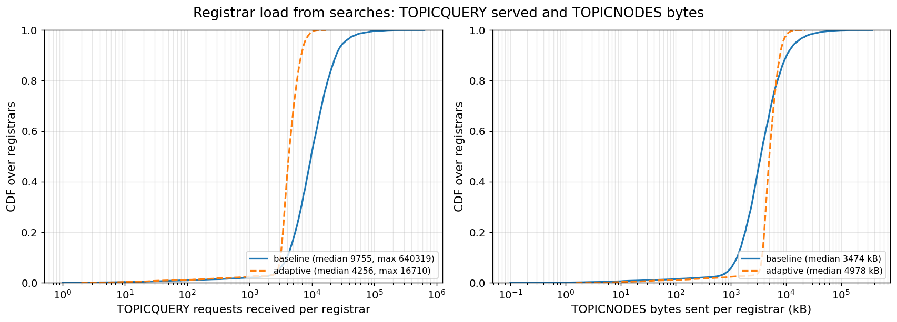
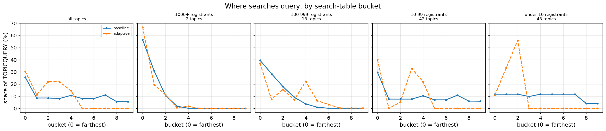
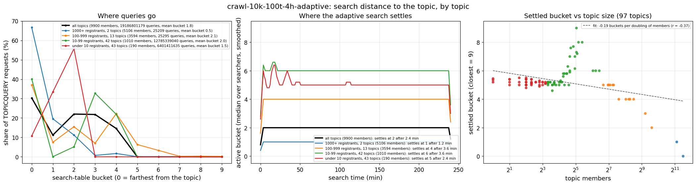
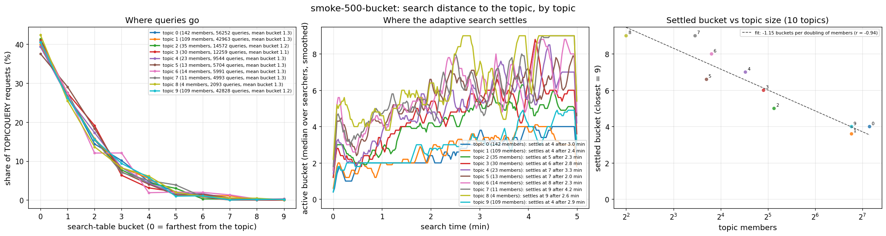

# Adaptive topic search distance

Branch `topicsearch-adaptive-distance` (on top of `topicsearch-result-filter`).
Design note and measurements, September 2026.

The procedure, its constants and a flow chart are in
[topic-search-adaptive-distance-algorithm.md](topic-search-adaptive-distance-algorithm.md).
Background on why the load concentrates at the topic hash is in the appendix.

## What changes

| | today (`search_yield_floor` 0) | adaptive (`search_yield_floor` > 0) |
|---|---|---|
| which bucket a query goes to | buckets open farthest first, one request each; then a random open bucket with unasked nodes per query, so every bucket gets the same share | one active bucket, chosen from the ad count of the replies: farther when replies are full, closer when they carry fewer ads than the floor |
| where popular topics are searched | everywhere, so the few nodes in the closest buckets answer every searcher | in the far buckets, where thousands of nodes share the load |
| where rare topics are searched | everywhere | close to the topic, where their ads are dense |
| re-asking a node | a search re-asks the nodes it seeds from on every pass | a node asked once is not re-asked for one ad lifetime (asked filter, shared across passes) |
| aux nodes in a reply | the registrar returns its first table entry per requested distance, the same few nodes to every searcher | a random node per distance (`Table.collectOnePerDist`), the one registrar-side change |
| a pass with nothing new to ask | ends | re-asks one already-asked node once for the new nodes its reply carries; a pass that walks its bucket dry moves one bucket closer |
| wire format | | unchanged; old and new searchers interoperate |
| knob | | `Config.SearchYieldFloor`, 0 = today's behaviour; 4 in every run |

## The rule

Expected ads per node at bucket *i* (0 = farthest) is
`RegBucketSize × R × 2^i / N` for a topic with R members in a network of N
nodes. On the 5k run: 4.5 per far node for topic 0 (R = 2240), 0.8 for
topic 4 (R = 408). Density doubles per bucket, so one density measurement
says how many buckets away a target density is.

The search keeps one **active bucket** and queries only there. Each reply's
ad count is a density sample for the bucket it came from:

- fewer than 16 records: the count is exact (the registrar returned
  everything it has);
- 16 records: censored, the node holds at least 16.

Decisions use the median of the last 4 samples in the bucket and need at
least 2 (one lying reply cannot steer the search):

| samples | action |
|---|---|
| median ≥ 16 (full) | retreat one bucket farther |
| median ≥ `SearchYieldFloor` | stay |
| 0 | jump 4 buckets closer |
| 0 < median < floor | jump `ceil(log2(floor / median))` closer, at most 4 |

Popular topics settle in the far buckets, whose thousands of nodes share the
load; rare topics descend to where their ads are dense, exactly as today.

An explicit "ads held" field in the reply was considered and rejected: it is
free to lie in, whereas lying through the reply itself costs signed records
and can only push a searcher one bucket the wrong way, where real replies
correct it. The two possible lies bound the damage at the status quo: a
deflated (empty) reply sends the searcher closer, i.e. today's behaviour.

### Walking a bucket

The distance rule alone moves the load but does not reduce it: a pass over
one bucket is short, so an unpaced searcher runs several times more passes,
and every pass re-asks the nodes it seeds from. Three changes make a search
walk its bucket once instead:

1. **Asked filter.** Nodes an adaptive search has queried are removed from the
   table and not re-admitted for one ad lifetime (a `SearchFilter`, shared
   across passes of the same search). Their slots refill with aux nodes from
   replies, which are requested for the active distance first.
2. **Random aux node per distance.** A registrar answering the aux part of
   TOPICQUERY / REGTOPIC returned the first table entry at each requested
   distance; every searcher was handed the same few nodes. It now
   reservoir-samples one node per distance (`Table.collectOnePerDist`).
3. **Spare re-ask.** A pass whose seeds are all already asked re-asks one of
   them, once, purely for the aux nodes its reply carries, and walks on from
   there. A pass that walks its bucket dry moves one bucket closer for the
   next pass.

With these, each node is asked about once per searcher per ad lifetime and
the load is flat across the ID space. The asked filter also removes the
re-walk of exhausted searches for the adaptive mode: within an ad lifetime a
search does not ask the same registrar twice.

## Results

The current evaluation is the 10000-node crawl-driven A/B; the 500-node and
5000-node runs are earlier iterations kept for the record.

### 10000 nodes, 100 crawl topics, churn (current)

The evaluation that matters: 10000 nodes over the 100 largest chains of the
2026-09-18 discv5 crawl (two mainnet-sized topics of 2000+ members, 13 of
100–999, 42 of 10–99, 43 under 10), the crawl's churn replayed for 4 h with
departing nodes shut down, connection-driven search (a node stops searching
once its 16 outbound peer slots are full), same duration on both sides,
`search_yield_floor` 0 against 4. Testbed build with the spec table sizes
(10 buckets, 16 per search bucket, 5 registration copies per bucket).

| | baseline | adaptive |
|---|---:|---:|
| mean recall per searcher | 0.126 | 0.127 |
| search requests (TOPICQUERY) per registrar p50 / p99 / max | 9755 / 70934 / 640319 | 4256 / 9599 / 16710 |
| queries per searcher, topics under 10 members (median) | 186k | 66k |
| queries per searcher, 10–99 members | 130 | 90 |
| time to first admission p50 | 17.0 s | 3.6 s |
| lookup share of bytes sent | 29.5 % | 16.8 % |
| dead results / max age | 0.6 % / under 15 min | 0.66 % / 888 s |

Recall is the connection model's (16 peers per node) and identical. Counting
only search requests, since registration is the same on both sides, the
busiest registrar takes 38× fewer and the p99 7× fewer; with the registrars
less loaded, a registration is admitted five times sooner.

Where the queries go, by search-table bucket (0 = farthest from the topic),
per topic-size class: the baseline spreads its queries over every bucket,
including the close ones that a handful of nodes hold; the adaptive search
keeps the mainnet-sized topics in buckets 0–1 and sends nothing to buckets
5–9.

Where the adaptive search settles, from the searchers' own traces (the
active bucket over time and the settled bucket against topic size):
mainnet-sized topics stay in bucket 1, topics of hundreds of members settle
in bucket 4, tens of members in bucket 6, and the tiny topics stop around
bucket 5 rather than descending further. The correlation with topic size is
weaker than at 500 nodes (0.45 against 0.94 on the smoke below), which is
an open item.

Bytes are not reduced. Summed over all nodes for the 4 h:

| message type | baseline | adaptive |
|---|---:|---:|
| total sent | 133.2 GB | 134.3 GB |
| TOPICQUERY | 22.9 GB, 148 M msgs | 21.5 GB, 90 M msgs |
| TOPICNODES (ad replies) | 16.4 GB | 1.0 GB |
| NODES (aux node records) | 70.6 GB | 84.7 GB |
| WHOAREYOU (handshakes) | 1.8 GB, 29 M | 4.0 GB, 63 M |
| registration (REGTOPIC, confirmation, renewal) | 9.0 GB | 9.2 GB |

The hotspot traffic (ad replies, concentrated on the nodes nearest each
topic) drops 16×. The saved bytes come back as aux node records: the
adaptive query lists the distances it wants refilled, so a query is ~240 B
instead of ~155 B and a reply carries a fuller set of records (~0.9 kB
against ~0.5 kB), and it talks to new nodes rather than re-asking known ones,
so handshakes double. The honest summary is: same bytes, no hotspot, faster
admissions.

The total is dominated by something the distance rule does not touch: the
searchers of topics under 100 members never fill their peer slots and re-walk
the network for the whole run (45 M of the adaptive run's queries, against
51k from the 8700 searchers of the two mainnet-sized topics). Throttling
exhausted searches (the pass loop) is the lever for total traffic.

## Proposed modifications

1. **Request aux nodes for the active bucket and its neighbours only.** The
   adaptive query lists every free distance after `active ± 1`, and the
   registrar fills up to `AuxNodesLimit` (8) of them. NODES records are 63 %
   of all bytes on both sides and 14 GB higher on the adaptive side. Limiting
   the request to three distances caps the aux payload at 3 records per reply
   and should remove most of that difference; it needs a test.
2. **Back off the pass loop.** Searches that cannot finish re-walk every pass
   and produce 45 M of the 45 M queries of the 10k run outside the two
   mainnet-sized topics. A pass back-off is the lever for total traffic on
   both variants.
3. **Sweep the floor.** 4 everywhere so far; lower keeps the search farther
   out, higher moves it in sooner.

## Open items

- **Handshakes.** Asking new nodes each time doubles session setups. Cheap
  in bytes, but 63 M handshakes at 10k in 4 h is the cost of the asked filter.
- **Tiny topics stop at bucket 5.** At 10k the topics under 10 members settle
  around bucket 5 of 10 instead of the closest buckets, and their query share
  peaks in bucket 2 (the helper path asks where the table has nodes). Their
  yield traces should say whether the walked-dry step or the helper path caps
  the descent.
- **Peak load still scales with searchers.** For a topic whose answering set
  is the far half, peak load is S/(N/2): flat in popularity but linear in S.
  Sub-linear growth needs members answering from their own result sets, or
  caching along the path.
- **Registrar-side pressure** (a topic's share of one node's cache feeding the
  waiting time) would push registrations outward as a topic grows; the
  natural complement, not needed for the search-side result.

## Appendix

### Background: the problem

In a TopDisc network the load a registrar carries for a topic grows linearly
with the topic's popularity, and it lands on the few nodes closest to the
topic hash. Measured on a 5000-node simnet run (5 topics, Zipf s = 1, unpaced
continuous search, 1.3 h):

| topic | members | TOPICQUERY received, median node | p99 | busiest node |
|---:|---:|---:|---:|---:|
| 0 | 2240 | 1340 | 114k | 204k |
| 1 | 1065 | 750 | 64k | 116k |
| 4 | 408 | 304 | 28k | 48k |

The busiest node on the largest topic takes 4.3× the busiest on the smallest
(5.5× the members), and on every topic the top 1 % of nodes absorb about 30 %
of that topic's queries. By message type the bias is entirely on the
registrar side of the search exchange: TOPICQUERY received (CV 1.22 across
the ID space) and TOPICNODES / NODES / REGCONFIRMATION sent (CV 1.0–1.2),
against 0.06–0.2 for everything else. TOPICNODES alone was 166 GB of a
230 GB run.

Registration is already metered: the waiting time paces admissions per
registrar, and REGTOPIC + REGCONFIRMATION was 2.5 GB in the same run. Nothing
meters queries; a registrar answers every TOPICQUERY with up to 16 records.

### Why the search converges

The search table (`topicindex.Search`) keeps buckets by log-distance to the
topic, farthest first, up to `SearchBucketSize` nodes each. Registration
places `RegBucketSize` (5) copies of every ad in every bucket, so ads exist at
every distance. The search opens buckets farthest first: `QueryTarget` scans from the far
end and stops at the first bucket that has never been queried, so a bucket
opens once the one before it has received a request. Among the open buckets
that still hold unasked nodes it then picks one *at random*. A bucket opens
after a single request, so in a long-lived search every bucket is open
within a few rounds and each query goes to a random bucket. Each bucket
therefore receives about the same share of queries, while
bucket populations halve with each step toward the topic: with 5000 nodes the
far bucket holds ~2500, the closest ones a handful. A searcher's far bucket is
16 random nodes out of 2500, different for every searcher; its closest
buckets are the same ~20 nodes for everyone.

Per node, on the 5k run:

- far bucket: 2240 searchers × 90 passes × 16/2500 ≈ 1.3k queries
- closest bucket: every searcher, every pass ≈ 100k

Popularity multiplies the searcher count; the hot set stays the same size.

A second cost stacks on it: a close node holds ~900 ads of a big topic and
answers with a random sample of 16, so one searcher needs ~380 queries to
exhaust it (coupon collector). The hottest nodes are also the least efficient
to ask.

### Implementation notes

- `p2p/discover/topicindex/common.go`: `Config.SearchYieldFloor`. Zero keeps
  the previous behaviour (every bucket, random bucket per query); the
  adaptive mode is off by default.
- `p2p/discover/topicindex/search.go`: active bucket, per-bucket yield
  samples, `observe` (the rule above), `adaptiveTarget` (active bucket,
  then the nearest populated bucket farther side first, then a spare),
  `IsDone` ending a pass once the settled bucket is exhausted, asked filter,
  `SetActiveBucket` / `SetAskedFilter` to carry state across passes.
- `p2p/discover/v5_topic.go`: carries the active bucket and asked filter
  between passes of a `topicSearch`.
- `p2p/discover/table.go`: `collectOnePerDist` samples a random node per
  distance.
- Testbed: `scenario.topic.search_yield_floor`, plumbed to simnet and real
  nodes, shown in the report's parameter table.

No wire change. Old and new searchers interoperate; the registrar-side change
(random aux node) helps both.

### Earlier results: 500 nodes

500 nodes, 5 topics (Zipf s = 1), unpaced continuous search for 5 min on
simnet, same binary, `search_yield_floor` 0 (A) vs 4 (B). Both sides include
the random aux pick.

Load, topic 0 (227 searchers):

| | A | B |
|---|---:|---:|
| queries per searcher | 2113 | 398 |
| busiest registrar (TOPICQUERY received) | 5245 | 439 |
| top-6 nodes' share of the topic's queries | 6.5 % | 2.4 % |
| queries per node by bucket, far → close | rising to 5245 | 138–246, flat |
| TOPICNODES bytes, whole run | 1743 MB | 142 MB |
| NODES bytes | 951 MB | 525 MB |
| new results per query | 0.11 | 0.57 |

Recall is 100 % on every topic in both. Discovery time, median over
searchers:

| | topic 0 (227) A → B | topic 4 (47) A → B |
|---|---|---|
| first result | 0.1 → 0.1 s | 0.1 → 0.1 s |
| 16 results | 0.7 → 0.7 s | 1.8 → 2.5 s |
| 50 % of registrants | 16.5 → 22.5 s | 3.1 → 5.6 s |
| 90 % | 50.1 → 44.3 s | 18.4 → 19.0 s |
| 99 % | 74.2 → 94.1 s | 26.1 → 25.0 s |

Lookup-sized searches are unchanged on the popular topic and ~0.7 s slower on
rare ones (the probe before the search settles). Full recall on the popular
topic has a slower tail: a far reply carries ~4.5 ads instead of 16, and the
last registrants are those whose copies sit on far nodes not yet walked.

Scheduled lookups (one per node per interval, stop at 16 results; 235–1132
lookups per topic): 3.9 → 4.0 queries per lookup on topic 0, 7.4 → 9.5 on
topic 4; all lookups reached 16 results; latency p50 135 → 136 ms on topic 0.

What the iterations showed, for the record: the distance rule with a fixed
candidate set moved the load to the far bucket but onto the seed nodes
everyone knows (busiest 13.8k vs 5.5k); evicting asked nodes within a pass
walked 229 of 250 far nodes but passes still restarted from the same seeds;
the cross-pass asked filter brought the busiest node to 227 (= one query per
searcher) but stranded searches at 79–97 % recall; the random aux pick and the
spare re-ask restored 100 %.

### Earlier results: 5000 nodes

Same scenario as the 5000-node baseline above (5 topics, Zipf s = 1, unpaced
continuous search), floor 4, 3 h of search against the baseline's 1.3 h.
Both reached 100 % recall on every topic. Per-hour figures normalise the
different durations.

| topic 0 (2240 searchers) | baseline | adaptive |
|---|---:|---:|
| busiest registrar, TOPICQUERY received | 204k in 1.3 h | 34k in 3 h (14× lower per hour) |
| p99 registrar | 114k | 23k |
| median registrar | 1.3k | 6.6k (load spread, not removed) |
| queries per node by bucket, far → close | 1.3k rising to 204k | 5.5k, 10.6k, 11k, 8.3k, then falling to 0.6k |
| queries per searcher per hour | 9.9k | 5.6k |
| TOPICNODES bytes per hour | 128 GB | 37 GB |
| NODES bytes per hour | 31 GB | 36 GB |
| time to 16 results | 0.4 s | 0.4 s |
| time to 90 % / 99 % of registrants | 110 s / 280 s | 191 s / 513 s |

The hotspot at the topic hash is gone; the load now peaks in buckets 1–3,
where a floor of 4 settles the search (the far half has ~4.5 ads per node
for this topic, right at the floor). The tail of full recall is 1.8× slower.
Steady state is dominated by the pass loop: 3400 passes per searcher in 3 h,
each costing a spare query plus whatever the walk finds, so a pass back-off
is the next lever, and the NODES growth comes from aux nodes feeding the
walk at every pass.

