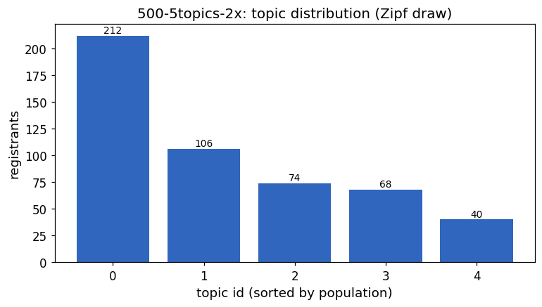
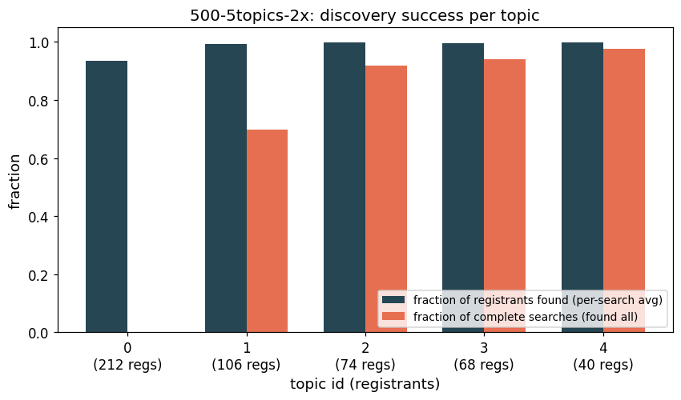
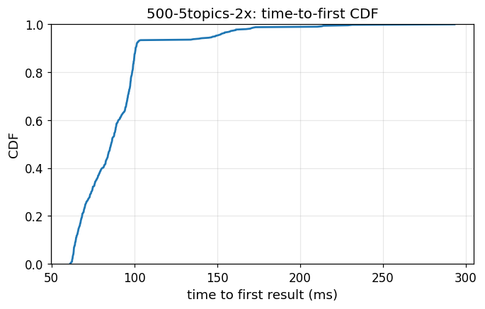
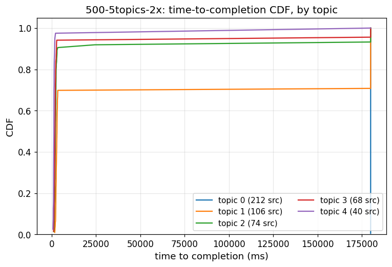
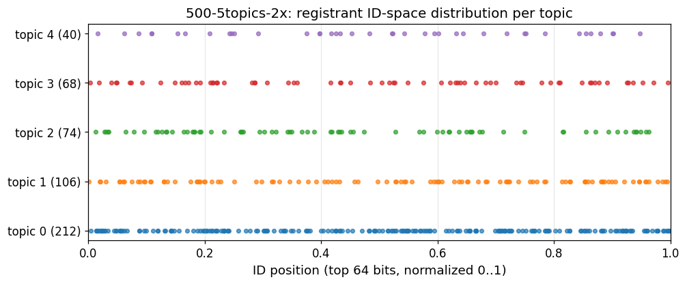
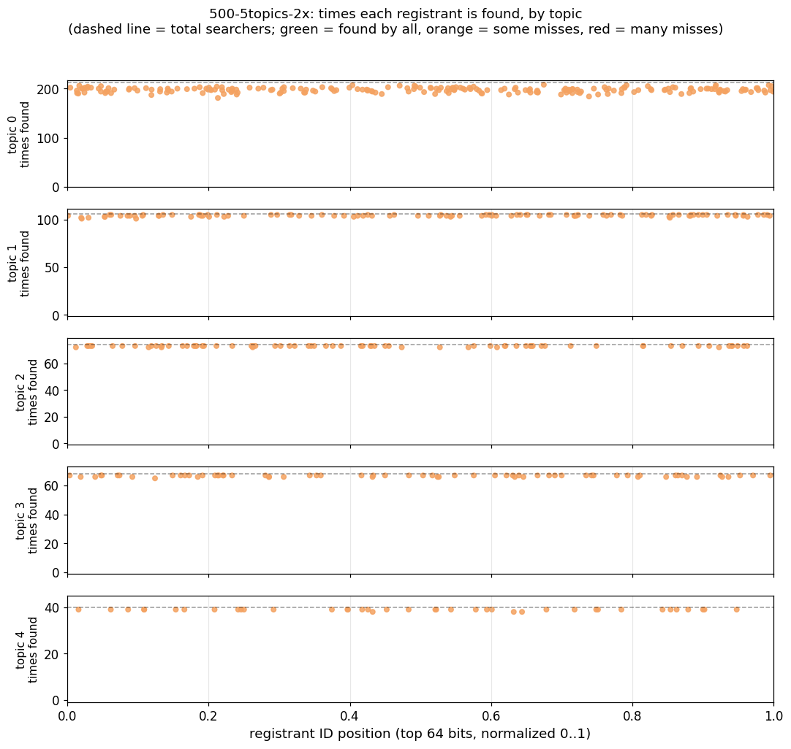
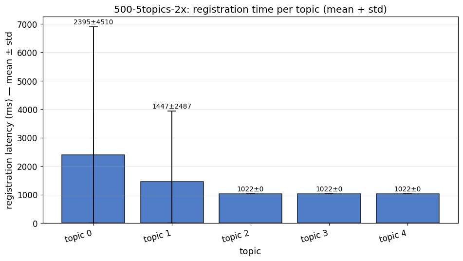

# Simnet experiment report — `500-5topics-2x`

## Simulation parameters

| parameter | value |
|---|---|
| nodes | 500 |
| DISC-NG nodes | 500 (frac = 1) |
| topics | 5 |
| Zipf skew (s) | 1.07 |
| RNG seed | 1 |
| per-link latency | 30 ms |
| per-link bandwidth | 100 Mibps (each direction) |
| max bootnodes per node | 20 |
| bootstrap wait | 120 s |
| register wait | 180 s |
| per-search timeout | 180 s |
| registration probe period | 1 s |

## Workload

Each DISC-NG node is assigned exactly one topic via a single Zipf draw, and **both registers and searches the same topic**. Every node makes one search; a search target is the set of *other* nodes that registered the same topic (self-exclusion). Vanilla discv5 nodes participate in routing-table maintenance (PING / FINDNODE) but neither register nor search.

Recall metrics are computed per searcher as `foundRegistrant / target`. A search terminates either when `foundRegistrant ≥ target` or when the per-search timeout fires.

## Aggregate results

| metric | value |
|---|---|
| searchers | 500 |
| full-recall searchers | 245 / 500 |
| timeouts | 255 / 500 |
| mean recall | 0.9702 |
| time to first result, p50 | 86.0 ms |
| time to first result, p95 | 148.9 ms |
| time to completion, p50 | 180000.0 ms |
| time to completion, p95 | 180000.1 ms |

## Per-topic results

| topic | regs | searchers | full recall | timeouts | mean recall | t1st p50 (ms) | tc p50 (ms) | tc p95 (ms) |
|---:|---:|---:|---:|---:|---:|---:|---:|---:|
| 0 | 212 | 212 | 0 / 212 | 212 | 0.9355 | 86.3 | 180000.1 | 180000.2 |
| 1 | 106 | 106 | 74 / 106 | 32 | 0.9928 | 82.5 | 2970.7 | 180000.1 |
| 2 | 74 | 74 | 68 / 74 | 6 | 0.9983 | 87.8 | 2123.8 | 180000.0 |
| 3 | 68 | 68 | 64 / 68 | 4 | 0.9956 | 84.1 | 1869.9 | 2858.9 |
| 4 | 40 | 40 | 39 / 40 | 1 | 0.9981 | 95.4 | 1265.0 | 1799.5 |

## Registration timing per topic

Time from `RegisterTopic` call until the registrant first appears in *any* remote DISC-NG node's local topic table. Sampled by polling every 1 s; values therefore have step granularity equal to the probe period.

| topic | registered | mean (ms) | std (ms) | p50 (ms) | p90 (ms) | p99 (ms) |
|---|---:|---:|---:|---:|---:|---:|
| topic 0 | 212 | 2395 | 4510 | 1022 | 1022 | 19022 |
| topic 1 | 106 | 1447 | 2487 | 1022 | 1022 | 16022 |
| topic 2 | 74 | 1022 | 0 | 1022 | 1022 | 1022 |
| topic 3 | 68 | 1022 | 0 | 1022 | 1022 | 1022 |
| topic 4 | 40 | 1022 | 0 | 1022 | 1022 | 1022 |

## Figures

### 01_topic_distribution

*Topic distribution: registrants per topic, sorted by population (Zipf head on the left).*

### 02_per_topic_recall

*Per-topic discovery success: bars show the per-search average fraction of registrants found and the fraction of searches that found *all* registrants (complete searches).*

### 03_time_to_first_cdf

*CDF of time-to-first result across all searchers.*

### 04_time_to_completion_cdf

*Per-topic CDF of time-to-completion.*

### 05_id_space_registrants

*Strip plot showing registrants placed in the ID space (top 64 bits, normalized 0..1), one row per topic.*

### 06_id_space_found_vs_missed

*Per-registrant discovery coverage, one subplot per topic. x = registrant ID position, y = number of times the registrant was found across all searches in the simulation. Green = found by every searcher, orange = some misses, red = many misses.*

### 07_registration_time_bar

*Mean registration latency per topic with std error bars (clipped at 0).*

